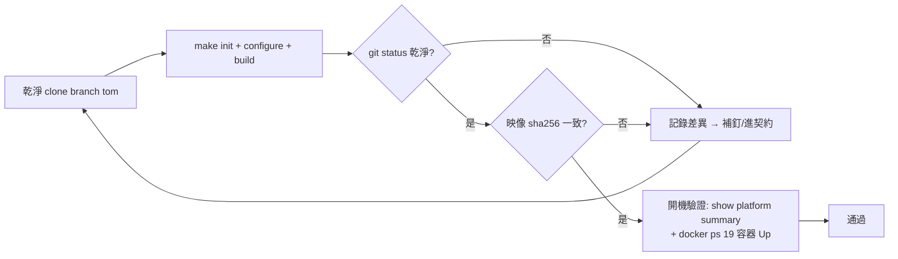

# SONiC OT-VS 建置契約(Build Contract)

- 目的:釘死所有會漂移的建置變數,使任何人在任何機器上編出的「必要修改」一致
- 簽署狀態:待雙方(tom / Joe)確認
- 配套:`SONiC-OT-VS-Build-Fixes-Analysis.md`(修改歸因)、`SONiC-OT-VS-Build-Troubleshooting.md` §6(建置 SOP)

## 1. 原始碼

| 項目 | 值 | 狀態 |
|------|-----|------|
| repo 分支 | `tom`(基於 `origin/otn_pre_202411` = `189b747f7`;tip 以 fork 現值為準) | 已固定 |
| submodule `src/sonic-linux-kernel` | `8ce2a4987`(D17 URL 修正) | 已固定 |
| submodule `src/sonic-swss` | 回歸上游基點 `4eb74f008`(測試跳過改由 superproject knob `rules/swss.mk`) | 已固定 |
| submodule `src/sonic-bmp` | `2e07a74a2`(exec bit) | 已固定 |
| 其餘 submodule | 由 superproject gitlink 釘死,`git submodule update --init --recursive` | 已固定 |
| 分支取得方式 | `git fetch https://github.com/hoholee8991/sonic-buildimage.git tom`;submodule fork:`hoholee8991/{sonic-linux-kernel,sonic-bmp}`(sonic-swss 已無差異 commit);離線備援:`ot-vs-tom-*.bundle` | 已可用 |

## 2. Debian 套件源

| 項目 | 值 | 落點 |
|------|-----|------|
| bullseye main + security | `snapshot.debian.org/archive/debian{,-security}/20260601T000000Z/` | `scripts/build_mirror_config.sh` |
| bullseye-backports | `snapshot.debian.org/archive/debian/20241001T000000Z/`(priority 100,僅顯式使用) | 同上 |
| tracing libs(libtracefs*/libtraceevent*) | pin `n=bullseye-backports`,priority 600 | `sonic-slave-bullseye/backports-pin`;**E5 實證(2026-09-24,slave 容器)**:無 pin 時 `apt-get build-dep linux` EXIT=100,pin 必要 |
| bookworm kernel source | `deb.debian.org`(200 驗證);Joe 備援解:snapshot `20240621T151025Z` | `src/sonic-linux-kernel/Makefile`(D17 去重決策:留我方) |
| bookworm 超源(snmpd/openssh 舊版 dsc) | `snapshot.debian.org` | `rules/snmpd.mk`、`rules/openssh.mk`(Joe WIP commit 內) |

⚠️ snapshot 時戳寫死在 script 內;日後任何一次「再釘」必須更新本表並通知對方。

## 3. 容器基底映像

| 項目 | 現況 | 狀態 |
|------|------|------|
| bullseye slave `FROM {{ prefix }}debian:bullseye` | 已釘 `@sha256:da5c2dc5e036efbfa25b4a0abfb41e497a44c3e9ab630e8ef6699600790511e7`(amd64 manifest,Joe 2026-09-01 anchor,pull 已驗證;Dockerfile.j2 三處皆為 amd64 host stage) | 已固定 |
| bookworm/buster slave `FROM` | 仍為 floating tag(ot-vs 的 kernel 在 bookworm slave 建,同樣會漂移) | ⚠️ 待辦:同法釘 digest |
| qemu-user-static(multiarch) | 版本已寫死於 `Dockerfile.j2`(如 `x86_64-arm-6.1.0-8`) | 已固定 |
| `DEFAULT_CONTAINER_REGISTRY` | Joe 用 `""`(容器全部本地建);我方值待確認 | ⚠️ 待對齊 |
| 本機已建 slave 映像 | `sonic-slave-bullseye:6b67c9c214e`、`sonic-slave-bookworm:a9f2d3231b1` 等 | 僅本機參考;跨機一致化依賴上面 digest 釘選 |

## 4. 主機與工具鏈

| 項目 | 值 |
|------|-----|
| 平台 | Windows + WSL2 Ubuntu-26.04(systemd 已啟用);建置一律在 WSL ext4 `~/sonic-buildimage` |
| 資源 | 8 CPU / 12GB RAM / swap 8GB(`.wslconfig`) |
| Docker | docker-ce 29.8.1,`--privileged` 容器可取用 `/dev/kvm` |
| j2 工具 | Makefile.work 接受 jinjanator(j2cli 後繼);本機 j2cli 0.3.10 + importlib shim 補丁 |
| KVM | 建議有;無時靠 `install_sonic.py` 3600s timeout(TCG 慢) |

⚠️ 絕不在 `/mnt/d`(NTFS)上建置:大小寫不敏感與權限問題(排解 §3-B8、A3)。

## 5. 建置目標與測試政策

| 項目 | 值 | 狀態 |
|------|-----|------|
| 目標映像 | `sonic-ot-vs.img.gz`(主)、`sonic-4asic-ot-vs.img.gz`;**6asic 已裁撤(2026-09-24)**——其平台目錄實為 4asic 複製品(`NUM_ASIC=4`) | 已定案 |
| 平台 | `x86_64-ot_kvm_x86_64_4_asic-r0` / HwSKU `alibaba_4_asic_vs` / ASIC Count 4 | 已驗證 |
| 測試政策 | sonic-config-engine `_TEST = n`;systemd-sonic-generator、sonic-swss `dh_auto_test` no-op | 待雙方確認 |
| 登入 | `admin` / `YourPaSsWoRd` | — |

## 6. 建置與驗證流程

```bash
# WSL 內;完整 SOP 見 Troubleshooting §6
cd ~/sonic-buildimage
git checkout tom && git submodule update --init --recursive
make init
make configure PLATFORM=ot-vs
make SONIC_BUILD_JOBS=6 target/sonic-ot-vs.img.gz
gzip -t target/sonic-ot-vs.img.gz          # 完整性;435 bytes = CI stub(失敗品)
```

## 7. 產物指紋(2026-09-22 建置,2026-09-24 計算)

| 產物 | 大小(B) | sha256 |
|------|---------|--------|
| `sonic-ot-vs.img.gz` | 871,000,547 | `2cbf63ed7d6fd980db6af724fd54ebc38b94a00a2ca9f2f718253b70c0d4c244` |
| `sonic-4asic-ot-vs.img.gz` | 870,832,202 | `6adf7870d9b8148bdd1cd6e2a676c513d20d87b03ba9caade6e30122fc5ebf69` |
| `sonic-6asic-ot-vs.img.gz` | 870,765,467 | `fb82d94a02f2cac0c504b4a2b12fb50aac4689055c727b94a35886f9bc809e37`(已裁撤,僅存檔參考) |

## 8. 驗收標準(可重現性閉環)



驗收條件三擇全中:

- git status 乾淨(零額外修改)
- 映像 sha256 與 §7 一致
- 開機基準達 `Troubleshooting §8.4`(4 ASIC + 19 容器 Up,重開機自動恢復)

任何殘差 = 尚未釘死的環境變數,必須回到本契約補釘,而不是各自加 private 修改。

## 9. 參考來源

- 建置 SOP 與耗時:`SONiC-OT-VS-Build-Troubleshooting.md` §6
- 開機驗證基準:同上 §8.4
- 產物指紋計算:2026-09-24,`sha256sum`(WSL `~/sonic-buildimage/target/`)
- 修改歸因:`SONiC-OT-VS-Build-Fixes-Analysis.md` §3
